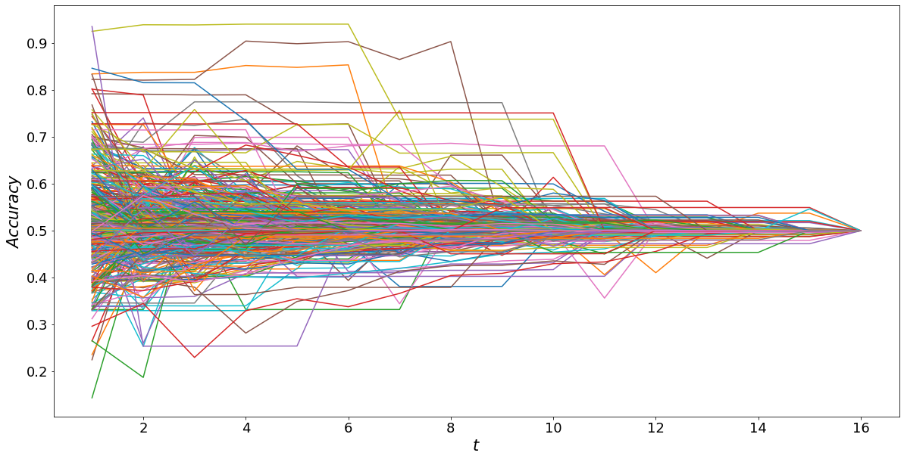
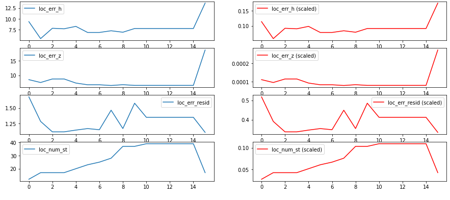
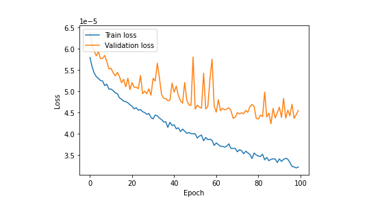
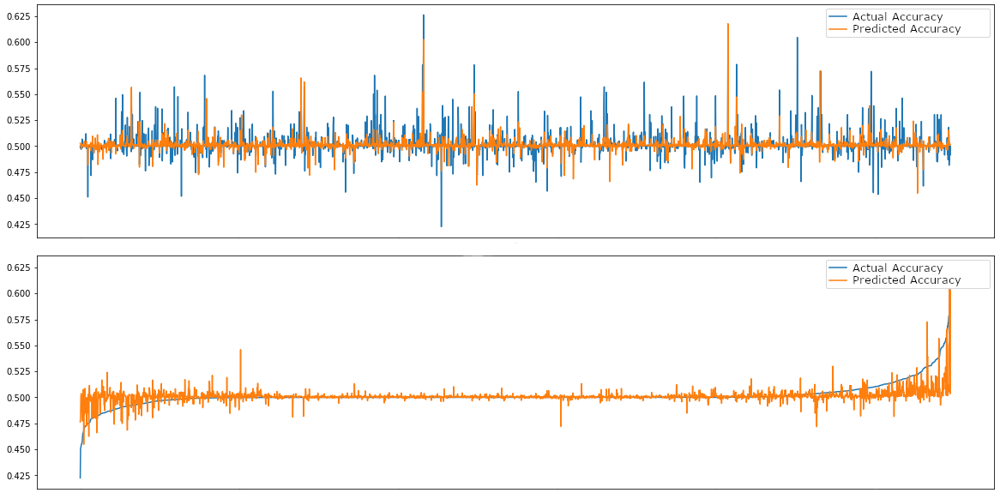

# Can a neural network learn to predict the accuracy of magnitude estimates shortly after an earthquake occurs?

## Outline

* Early-est Data
* Accuracy of Magnitude Estimates
* Feature Extraction and Labeling
* Model Definition
* Data Scaling
* Training Phase
* Evaluation

## Early-est Data

| Name               | Type    | Description                              |
|:-------------------|:--------|:-----------------------------------------|
| `evt`              | Integer | Event ID                                 |
| `min`              | Integer | Minute (or version)                      |
| `loc_err_h`        | Double  | Ellipsoid horizontal error               |
| `loc_err_z`        | Double  | Ellipsoid vertical error                 |
| `loc_err_resid`    | Double  | RMS of the residuals                     |
| `loc_num_st`       | Integer | Number of stations used for localization |
| `loc_min_dist`     | Double  | Distance of the nearest station          |
| `loc_avg_dist`     | Double  | Average distance of stations             |
| `loc_std_dist`     | Double  | Standard deviation distance of stations  |
| `loc_1st_azim_gap` | Double  | Primary azimuthal gap                    |
| `loc_2nd_azim_gap` | Double  | Secondary azimuthal gap                  |
| `mag`              | Double  | Estimated magnitude of type Mwp          |
| `mag_err`          | Double  | Magnitude error                          |
| `mag_num_st`       | Integer | Number of stations (<= loc_num_st)       |

## Early-est Data

### Selected Events

* 608 earthquakes from 2019-04-15 to 2020-01-30
* All location versions from min 1 to 16 are present
* Mwp `mag` estimate is present at every min
* `mag` at min 16 is $\ge 5$

### Accuracy of `mag`

* $mag_t$ is the magnitude estimate at min $t$
* Consider $mag_{16}$ the most accurate estimate
* $accuracy(mag_t) := \frac{mag_t - mag_{16} + 1}{2}$

## Accuracy of Magnitude Estimates

## Feature Extraction

* $Par_t^e(p)$ is the estimated param $p$ of event $e$ at minute $t$, e.g.
    * $Par_2^{100}($`loc_err_h`$)$ is the estimated ellipsoid horizontal error of evt 100 at min 2

* $Par^e := (Par_1^e, Par_2^e, ..., Par_{N}^e)$ is the sequence of all param versions of evt $e$, from min 1 to $N$, with $N := 16$

* We obtain input features from $Par^e$ by computing $N-K+1$ sub-sequences of length $K$, with $K := 2$:

    * $X_1^e := (Par_1^e, Par_2^e, ..., Par_K^e)$,
    * $X_2^e := (Par_2^e, ..., Par_K^e, Par_{K+1}^e)$,
    * $\ldots$
    * $X_{N-K+1}^e := (Par_{N-K+1}^e, Par_{N-K+2}^e, ..., Par_N^e)$.

## Labeling

For each sequence $X_i^e$, of $K$ consecutive parameter versions, we compute the corresponding label $Y_i^e$, with $i = 1, 2, ..., N-K+1$:

* $Y_1^e := \frac{Par_K^e(\texttt{mag}) - Par_N^e(\texttt{mag}) + 1}{2}$,
* $Y_2^e := \frac{Par_{K+1}^e(\texttt{mag}) - Par_N^e(\texttt{mag}) + 1}{2}$,
* $\ldots$
* $Y_{N-K+1}^e := \frac{Par_N^e(\texttt{mag}) - Par_N^e(\texttt{mag}) + 1}{2} = \frac{0 + 1}{2} = \frac{1}{2} = 0.5$.

### Final Dataset (i.e. the samples)

* $T := \{(X_i^e, Y_i^e) : i \in 1, 2, ..., N-K+1, \forall e \in E\}$, where $E$ contains all the events

## Model Definition

| Layer | Type  | Activation fcn | Input dim     | Output dim |
|-------|-------|----------------|---------------|------------|
| 1     | LSTM  | ReLU           | ($K$, $P$)    | (2, 20)    |
| 2     | LSTM  | ReLU           | (2, 20)       | (10)       |
| 3     | Dense | Sigmoid        | (10)          | (1)        |

* $K := 2$ is the number of sequences per sample, e.g.
    * $Par^e = (Par_1^e, Par_2^e)$
* $P := 12$ is the number parameters per sequence, e.g.
    * $Par_1^e = (Par_1^e(\texttt{loc\_err\_h}), \ldots, Par_1^e(\texttt{mag}), \ldots)$
    * $Par_2^e = (Par_2^e(\texttt{loc\_err\_h}), \ldots, Par_2^e(\texttt{mag}), \ldots)$
    * $|Par_1^e| = |Par_2^e| = 12$

## Data Scaling

## Training Phase (Settings)

|                |                                |
|----------------|--------------------------------|
| Test Set       | 30% of Dataset                 |
| Training Set   | 70% of Dataset                 |
| Algorithm      | Adam                           |
| Loss Function  | Mean Squared Logarithmic Error |
| Batch Size     | 16                             |
| Validation Set | 25% of Training Set            |
| # of Epochs    | 100                            |

## Training Phase (History)

## Evaluation

# Thank you
